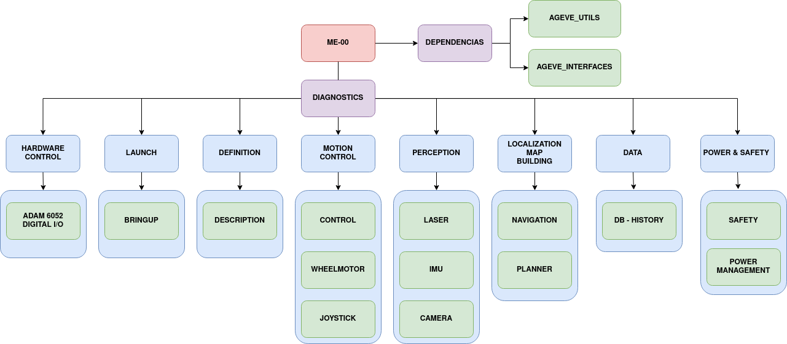

# AGL

Repositorio trabajo en `ROS2` para `AGL`.

## Arquitectura

`DIAGNOSTICS`: Package al cual todos los demás se subscriben. Conoce el estado de todos los packages

`BRINGUP`: Package con archivos tipo *launch* para ejecutar diferentes opciones de aplicativos

`DESCRIPTION`: Package para visualizar modelo vehículo en *Gazebo* y *rViz* 

`WHEELMOTOR`: Package para el driver motor, odometria y joints (de las ruedas)

`JOYSTICK`: Package para mover el vehículo manualmente mediante joystick

`CONTROL`: Package para el control de movimiento vehículo `auto|manual`. Comunicación con `HMI`

`LASER`: Package driver laser, creado por la comunidad se lanza desde el bringup.

