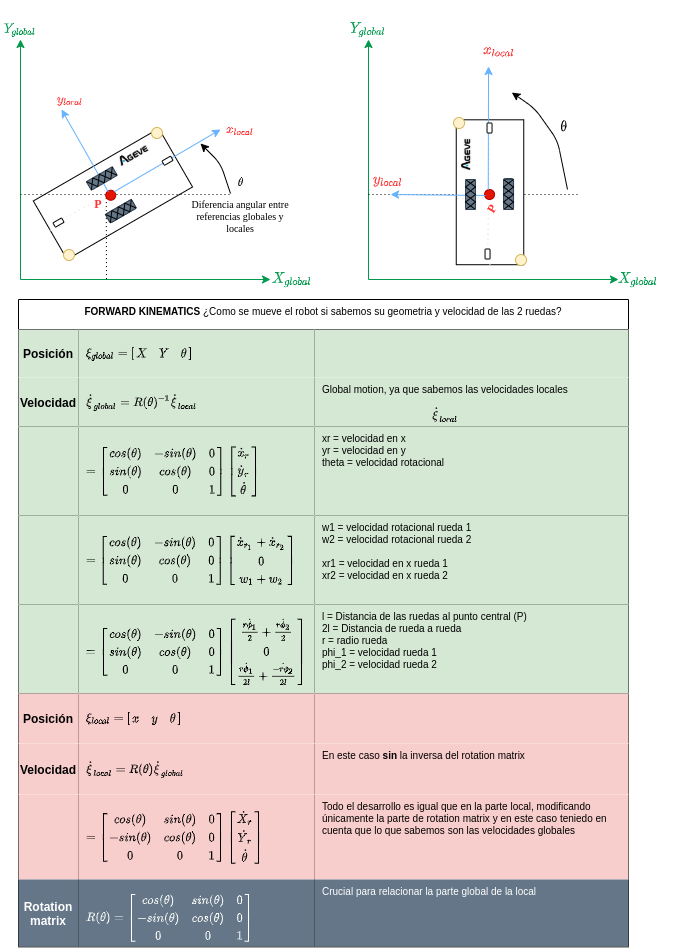
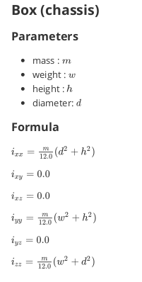
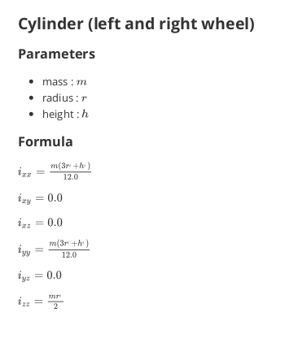
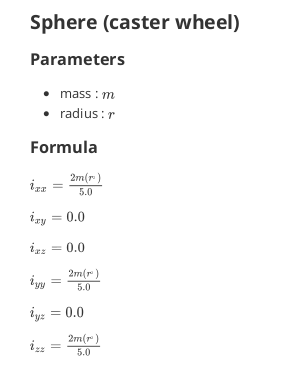

# ME-00 DESCRIPTION

Repositorio trabajo `DESCRIPTION` en `ROS2` para `AGL`.

Este repositorio contiene los modelos 3D del vehículo `AGL`. Estos modelos se realizan mediante una variante del formato `XML` conocido cómo `URDF`. Concretamente utilizamos `XACRO` que no es más que `URDF` con macros para poder automatizar la parametrización de estos archivos.

Estos archivos son necesarios únicamente para visualizar por pantalla una representación fiel del vehículo real. Esto es útil para simulaciones o visualizaciones en las que se representa por orenador lo que está haciendo el vehículo.


## Carpetas

`mesh`: Documentos CAD con las mallas del vehículo

`model`: Modelos creados, i.e casa, jayan_almacen1, me00...

`rviz`: Archivos de configuración rviz guardados

`urdf`: XACRO  y URDF del vehículo

`world`: Mundos creados, a partir de los modelos existentes


## Requisitos

Instalar `xacro`:

```bash
sudo apt install ros-foxy-xacro
```

Se debe hacer un `export` (recomendado colocar en `~/.bashrc`) de lo siguiente:

```bash
# En caso de compilar en workspace común
export ME00_Desc=~/<ROS_DIR>/<ROS_DISTRO>/install/me00_description/share/me00_description
export GAZEBO_RESOURCE_PATH=/usr/share/gazebo-11:$ME00_Desc/world:${GAZEBO_RESOURCE_PATH}
export GAZEBO_MODEL_PATH=/usr/share/gazebo-11/models:$ME00_Desc/model:${GAZEBO_MODEL_PATH}vv
```


## Kinematics




## Crear XACRO

La forma más fácil y rápida de crear un modelo para robot es utilizando  **XACRO**. Esto simplemente es un `XML` con funcionalidad de macros instalada.

Ejemplo de esqueleto en `xacro`: 

```xml
<?xml version="1.0"?>
<robot xmlns:xacro="http://www.ros.org/wiki/xacro" name="rastreator">
    <!--LINK 1-->
    <link name="name1">
      <inertial>
        <origin rpy="0 0 0" xyz="0.0 0.0 0.0"/>
        <mass value="0.0"/>
        <inertia ixx="0.0" ixy="0.0" ixz="0.0" iyy="0.0" iyz="0.0" izz="0.0"/>
      </inertial>
      <visual>
        ...
      </visual>
      <collision>
        ...
      </collision>
    </link>
    <!--LINK 2-->
    <link name="name2">
      <inertial>
        <origin rpy="0 0 0" xyz="0.0 0.0 0.0"/>
        <mass value="0.0"/>
        <inertia ixx="0.0" ixy="0.0" ixz="0.0" iyy="0.0" iyz="0.0" izz="0.0"/>
      </inertial>
      <visual>
        ...
      </visual>
      <collision>
        ...
      </collision>
    </link>
    <!--JOINT BETWEEN LINK 1 AND LINK 2-->
    <joint name="joint_1_2" type="fixed"> <!--THIS CAN BE FIXED, CONTINOUS OR REVOLUTE-->
        <origin rpy="0 0 0" xyz="0.0 0.0 0.0"/>
        <parent link="name1"/>
        <child link="name2"/>
    </joint>
</robot>
```

Ejemplo uso macro:

```xml
<!--base_link global variables-->
<xacro:property name="base_mass" value="2.0"/>
<xacro:property name="base_width" value="0.175"/>
<xacro:property name="base_len" value="0.2"/>
<xacro:property name="base_height" value="0.127"/>

<!--base_link call to inertia macro-->
<xacro:box_inertia m="${base_mass}" w="${base_width}" h="${base_height}" d="${base_len}"/>

<!--Macro for inertia-->
<xacro:macro name="box_inertia" params="m w h d">
    <inertial>
        <mass value="${m}"/>
        <inertia ixx="${m / 12.0 * (d*d + h*h)}" ixy="0.0" ixz="0.0" iyy="${m / 12.0 * (w*w + h*h)}" iyz="0.0" izz="${m / 12.0 * (w*w + d*d)}"/>
    </inertial>
</xacro:macro>
```


## Inercias

Info obtenida de  [wikipedia](https://en.wikipedia.org/wiki/List_of_moments_of_inertia)









## Crear URDF

Una vez `xacro` se ha creado, generar `URDF`:

```bash
ros2 run xacro xacro {nombre_robot}.xacro > {nombre_robot}.urdf namespace:={namespace_name}
```

Por ejemplo:
```bash
ros2 run xacro xacro me00.xacro > me00.urdf model:=me00 namespace:=/me00_1
```


## Crear SDF

Una vez `urdf` se ha creado, generar `SDF`:

```bash
gz sdf -p {nombre_robot}.urdf > ../model/{nombre_robot}_description/model.sdf
```

Por ejemplo:
```bash
gz sdf -p me00.urdf > ../model/me00_description/model.sdf
```
