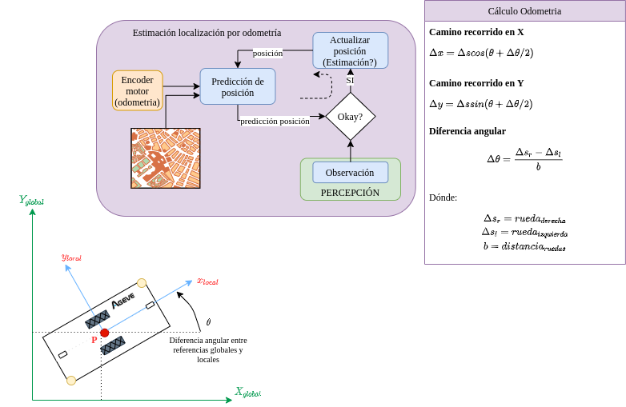

# ME-00 WHEELMOTOR

Repositorio trabajo `WHEELMOTOR` en `ROS2` para `ME-00`.

El modelo utilizado es el `ROBOTEQ MDC2460`. Como punto de partida utilizar el desarrollo de este driver para `ROS1` y adaptarlo a `ROS2`:
+ [Documentación de los drivers](https://www.roboteq.com/applications/all-blogs/30-installing-and-using-roboteq-s-ros-package)
+ [Source Code de los drivers](https://github.com/g/roboteq)

## Odometría

La parte de odometria para el driver motor esta contenido en una clase llamada `Odometry`. Esta clase se suscribe al topico de `encoder_count` que corresponde al contador de vueltas del encoder motor y con los correspondientes parametros de las ruedas puede calcular el desplazamiento del propio vehiculo.


## Configuración

Para configurar esta paquete se pueden modificar tres clases:
### Clase Principal del driver motor

Para esta clase es importante configurar los comandos que el controlador va a publicar.
+ frequencyH: Esta es la frecuencia de publicación (en ms) de la High frequency queries.
+ frequencyL: Esta es la frecuencia de publicación (en ms) de la Low frequency queries.
+ frequencyG: Esta es la frecuencia de publicación (en ms) de los General queries.
+ queryH: Este parametro incluye una lista con el nombre del topico a publicar y el valor de como se llama el string

### Clase Odometria

Esta clase cuenta con los parametros siguientes:
+ wheel_separation: Separación entre ruedas en cm.
+ wheel_radius: Radio de la rueda en cm.
+ frame_id: Nombre del `frame_id` de los mensajes.
+ child_frame_id: Nombre del `child_frame_id` del mensaje de la tranformada.
+ publish_tf: Activar/desactivar la publicación de la transformada.
+ publish_odom: Activar/desactivar la publicación la odometria.  

### Clase Controlador

Esta clase es la encarga de hacer la comunicación por TCP con el driver motor. Esta clase contiene dos tipos diferentes de sockets, una como cliente para comunicarse con un servidor y poder enviar comandos, y un socket de servidor para que un cliente pueda conectarse y nosotros recibir el flujo de datos constante del que los "produce". Para esta clase pues es importante modificar los siguientes valores:
+ ip: IP del servidor al que nos conectaremos
+ port: Puerto del servidor en el cual vamos a conectarnos.
+ timeout: Tiempo de espera para reiniciar al no poder iniciar la conexión.
+ listen_ip: Este es la ip para escuchar las peticiones de clientes. No se deberia de modificar.
+ listen_socket: Este es el puerto de escucha para procesar las peticiones de clientes.

## Simulacion

Para probar este paquete sin el driver motor de verdad se ha creado una mini aplicación de cliente servidor de TCP que se puede encontrar en en repositorio de [ROS2_COMM](https://github.com/ageve/ROS2_COMM). Para esto se deben de ejecutar los binarios compilados de `tcp_server` y `tcp_client` en diferentes terminales y cuando los dos esan conectadas podemos desde la terminal de cliente enviar la simulación de lo que nos enviaria el driver motor:
`caca_DH?1:1?2:2?3:3?4:4DL?5:5?6:6?7:7?8:8DG?9`
De la anterior string podemos dividirlo en cuatro bloques, separados por el caracter `D`. Estos son:
+ El primero `caca_` no nos interesa.
+ `H?1:1?2:2?3:3?4:4`: Donde a su vez podemos ver que la `H` del primer caracter nos aporta la informacion que correpsonde a la informacion de los `queryH`. Y ahora podemos hacer una separación por el caracter `?` para distinguir entre los valores de las diferentes queries.
  + `1:1`: Corresponde a la `queryH: motor_amps`, con los valores de cada 'channel' separados por el caracter `:`
  + `2:2`: Corresponde a la `queryH: motor_command`, con los valores de cada 'channel' separados por el caracter `:`
  + `3:3`: Corresponde a la `queryH: encoder_count`, con los valores de cada 'channel' separados por el caracter `:`
  + `4:4`: Corresponde a la `queryH: encoder_speed`, con los valores de cada 'channel' separados por el caracter `:`
+ `L?5:5?6:6?7:7?8:8`: Lo mismo que para las queries de arriba pero este caso los `queryL`.
+ `G?9`: En esta caso la `G` indica 'General queries' y despues separado por el caracter `?` tenemos los valores de cada query.

Sabiendo que el fichero de `config.params.yaml` contiene estos queries:
```
queryH:
 motor_amps : ?A 
 motor_command : ?M
 encoder_count : ?C
 encoder_speed : ?S
queryL: 
 error : ?E 
 feedback : ?F 
 battery_amps : ?BA
 power : ?P 
queryG: 
 fault_flag : ?FF 
```
## Arquitectura

En la arquitectura se ha utilizado los drivers de este repositorio adaptandolo a ROS2: [Link](https://github.com/Roboteq-Inc/ROS-Driver).

## Dependencias

Este paquete tiene dependecias del paquete de `ageve_interfaces`.

