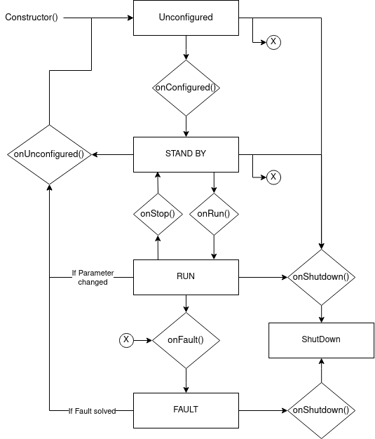

# ATLAS UTILS

Package with common functions and classes used in different `ATLAS` codes for `ROS2`.

## GENERAL UTILS

`GENERAL UTILS`: Accessible in `atlas_utils::general`.

Contains functions that are used across different `ATLAS` nodes.

## IMAGE UTILS

`IMAGE UTILS`: Accessible in `atlas_utils::image`.

Contains functions used across `ATLAS` nodes for compressing or decompressing images.

## STATE MACHINE UTILS

`STATE MACHINE`: Accessed in `atlas_utils::sm`.

Contains the StateMachine class used in many of the `ATLAS` nodes. This class has the necessary functions to implement the following state machine in the nodes:



## Compilation

To compile atlas_utils:
```bash
colcon build --symlink-install --packages-select atlas_utils
```
